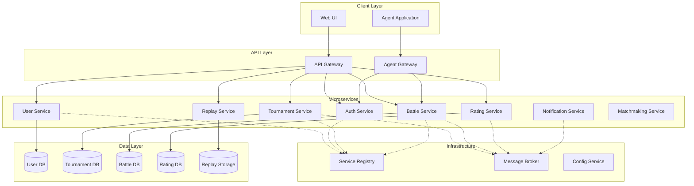
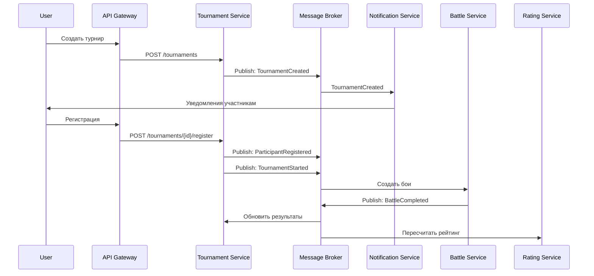
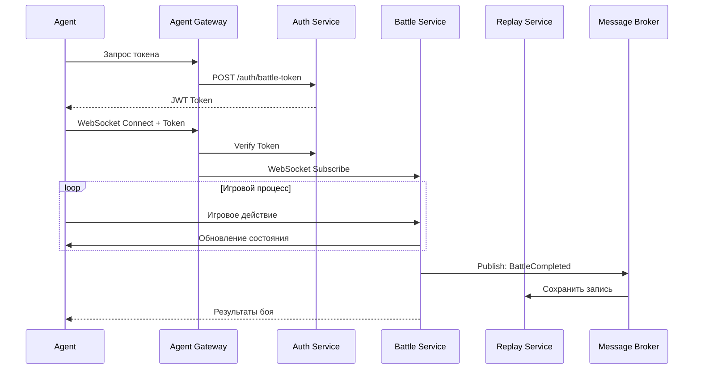

# Микросервисная архитектура игры "Космический бой"

## Оглавление
1. [Обзор решения](#обзор-решения)
2. [Архитектура системы](#архитектура-системы)
3. [Описание микросервисов](#описание-микросервисов)
4. [API и взаимодействие между сервисами](#api-и-взаимодействие)
5. [Узкие места и масштабирование](#узкие-места-и-масштабирование)
6. [Компоненты с изменяемыми требованиями](#компоненты-с-изменяемыми-требованиями)
7. [Технологический стек](#технологический-стек)
8. [Обоснование архитектурных решений](#обоснование-решений)

---

## Обзор решения

Архитектура игры "Космический бой" спроектирована с учетом принципов микросервисной архитектуры:
- **Декомпозиция по бизнес-возможностям** (business capabilities)
- **Один микросервис - одна база данных** (Database per Service)
- **Независимый деплой и масштабирование**
- **Ограниченные контексты** (Bounded Contexts из DDD)

### Ключевые бизнес-возможности:
1. Управление пользователями и аутентификация
2. Организация и проведение турниров
3. Проведение космических боев
4. Рейтинговая система
5. Уведомления пользователей
6. Просмотр записей боев
7. Взаимодействие с клиентскими агентами

---

## Архитектура системы

### Общая схема взаимодействия



---

## Описание микросервисов

### 1. User Service (Сервис управления пользователями)

**Ответственность:**
- Регистрация и управление профилями пользователей
- Хранение персональных данных
- Управление настройками пользователей

**База данных:** PostgreSQL (реляционная модель для пользовательских данных)

**API Endpoints:**
```
POST   /api/users/register          - Регистрация пользователя
GET    /api/users/{userId}          - Получение профиля
PUT    /api/users/{userId}          - Обновление профиля
GET    /api/users/{userId}/stats    - Статистика пользователя
DELETE /api/users/{userId}          - Удаление пользователя
```

**События (публикует):**
- `UserRegistered` - пользователь зарегистрирован
- `UserUpdated` - профиль обновлен
- `UserDeleted` - пользователь удален

---

### 2. Auth Service (Сервис аутентификации и авторизации)

**Ответственность:**
- Аутентификация пользователей
- Генерация и валидация JWT токенов
- Авторизация доступа к боям и турнирам
- Управление сессиями

**База данных:** Redis (для хранения токенов и сессий)

**API Endpoints:**
```
POST   /api/auth/login              - Вход в систему
POST   /api/auth/logout             - Выход
POST   /api/auth/refresh            - Обновление токена
POST   /api/auth/battle-token       - Токен для участия в бое
POST   /api/auth/verify             - Проверка токена
```

**Зависимости:**
- User Service (проверка учетных данных)
- Tournament Service (проверка участия в турнире)
- Battle Service (проверка участия в бое)

---

### 3. Tournament Service (Сервис турниров)

**Ответственность:**
- Создание и управление турнирами
- Регистрация участников
- Формирование сетки турнира
- Управление расписанием
- Отслеживание статуса турниров

**База данных:** PostgreSQL (сложные связи между турнирами, участниками, раундами)

**API Endpoints:**
```
POST   /api/tournaments                      - Создание турнира
GET    /api/tournaments                      - Список турниров
GET    /api/tournaments/{id}                 - Детали турнира
POST   /api/tournaments/{id}/register        - Регистрация на турнир
GET    /api/tournaments/{id}/participants    - Список участников
GET    /api/tournaments/{id}/schedule        - Расписание
GET    /api/tournaments/{id}/results         - Результаты
PUT    /api/tournaments/{id}/status          - Изменение статуса
```

**События (публикует):**
- `TournamentCreated` - турнир создан
- `ParticipantRegistered` - участник зарегистрирован
- `RegistrationApproved/Rejected` - решение по заявке
- `TournamentStarted` - турнир начался
- `TournamentCompleted` - турнир завершен
- `RoundScheduled` - раунд запланирован

**События (подписан):**
- `BattleCompleted` - обновление результатов турнира

---

### 4. Battle Service (Сервис проведения боев)

**Ответственность:**
- Организация космических боев
- Управление состоянием игры в реальном времени
- Валидация действий игроков
- Определение победителей
- Координация с клиентскими агентами

**База данных:** 
- MongoDB (гибкая схема для состояния игры)
- Redis (кэш для активных боев)

**API Endpoints:**
```
POST   /api/battles                  - Создание боя
GET    /api/battles/{id}             - Информация о бое
POST   /api/battles/{id}/start       - Начать бой
POST   /api/battles/{id}/action      - Действие в бою
GET    /api/battles/{id}/state       - Текущее состояние
POST   /api/battles/{id}/complete    - Завершить бой
WebSocket /ws/battles/{id}           - Real-time обновления
```

**События (публикует):**
- `BattleCreated` - бой создан
- `BattleStarted` - бой начался
- `BattleCompleted` - бой завершен
- `ActionExecuted` - действие выполнено

**События (подписан):**
- `TournamentStarted` - начало турнирных боев

---

### 5. Rating Service (Сервис рейтингов)

**Ответственность:**
- Расчет рейтингов игроков
- Расчет рейтингов турниров
- Хранение истории изменений рейтинга
- Формирование таблиц лидеров

**База данных:** PostgreSQL + Redis (для кэширования топов)

**API Endpoints:**
```
GET    /api/ratings/users/{userId}           - Рейтинг игрока
GET    /api/ratings/users/leaderboard        - Таблица лидеров
GET    /api/ratings/tournaments/{id}         - Рейтинг турнира
GET    /api/ratings/users/{userId}/history   - История рейтинга
POST   /api/ratings/calculate                - Пересчет рейтинга
```

**События (публикует):**
- `RatingUpdated` - рейтинг обновлен
- `LeaderboardChanged` - изменение в топе

**События (подписан):**
- `BattleCompleted` - расчет рейтинга после боя
- `TournamentCompleted` - расчет рейтинга турнира

**Алгоритм расчета:** ELO-подобная система с учетом:
- Результат боя (победа/поражение)
- Разница рейтингов участников
- Коэффициент турнира
- Регулярность участия

---

### 6. Notification Service (Сервис уведомлений)

**Ответственность:**
- Отправка уведомлений пользователям
- Поддержка множественных каналов (email, push, WebSocket)
- Управление подписками на уведомления
- Шаблонизация сообщений

**База данных:** MongoDB (для хранения истории уведомлений)

**API Endpoints:**
```
POST   /api/notifications/send              - Отправить уведомление
GET    /api/notifications/user/{userId}     - История уведомлений
PUT    /api/notifications/preferences       - Настройки уведомлений
WebSocket /ws/notifications                 - Real-time уведомления
```

**События (подписан):**
- `TournamentCreated` - уведомление о новом турнире
- `ParticipantRegistered` - подтверждение регистрации
- `RegistrationApproved` - одобрение заявки
- `BattleStarted` - уведомление о начале боя
- `BattleCompleted` - уведомление о завершении
- `RoundScheduled` - напоминание о предстоящем бое

**Типы уведомлений:**
1. Приглашение на турнир
2. Решение по заявке на участие
3. Скорое начало боя (за 5 минут)
4. Завершение боя
5. Изменение рейтинга
6. Начало нового раунда турнира

---

### 7. Replay Service (Сервис записей боев)

**Ответственность:**
- Запись хода боев
- Хранение записей
- Воспроизведение записей
- Генерация статистики по боям

**База данных:** 
- S3/MinIO (хранение файлов записей)
- MongoDB (метаданные записей)

**API Endpoints:**
```
POST   /api/replays                    - Сохранить запись
GET    /api/replays/{id}               - Получить запись
GET    /api/replays/battle/{battleId}  - Записи конкретного боя
GET    /api/replays/user/{userId}      - Записи пользователя
GET    /api/replays/{id}/stream        - Стриминг записи
DELETE /api/replays/{id}               - Удалить запись
```

**События (подписан):**
- `BattleCompleted` - сохранение записи боя

**Формат записи:**
- JSON с временными метками действий
- Сжатие gzip для экономии места
- Метаданные: участники, длительность, результат

---

### 8. Matchmaking Service (Сервис подбора противников)

**Ответственность:**
- Подбор противников для боев вне турниров
- Формирование сбалансированных пар по рейтингу
- Управление очередью ожидания

**База данных:** Redis (очереди и временные данные)

**API Endpoints:**
```
POST   /api/matchmaking/queue        - Встать в очередь
DELETE /api/matchmaking/queue        - Покинуть очередь
GET    /api/matchmaking/status       - Статус поиска
POST   /api/matchmaking/challenge    - Вызов на бой
```

**События (публикует):**
- `MatchFound` - противник найден
- `ChallengeReceived` - получен вызов

**События (подписан):**
- `RatingUpdated` - обновление рейтинга для подбора

---

## API и взаимодействие между сервисами

### Паттерны взаимодействия

#### 1. Синхронное взаимодействие (REST API)
Используется для:
- Запросы с немедленным ответом
- Получение данных
- CRUD операции

**Примеры:**
- Web UI → API Gateway → User Service (получение профиля)
- API Gateway → Auth Service (проверка токена)
- Agent Gateway → Battle Service (отправка действия)

#### 2. Асинхронное взаимодействие (Event-Driven)
Используется для:
- Уведомления о событиях
- Слабая связанность сервисов
- Обработка, не требующая немедленного ответа

**Message Broker:** RabbitMQ или Apache Kafka

**Примеры потоков событий:**

**Регистрация на турнир:**
```
1. User → API GW → Tournament Service: POST /register
2. Tournament Service → Message Broker: ParticipantRegistered
3. Notification Service ← Message Broker: отправить уведомление
4. Tournament Service → Message Broker: RegistrationApproved
5. Notification Service ← Message Broker: отправить уведомление
```

**Завершение боя:**
```
1. Battle Service → Message Broker: BattleCompleted
2. Rating Service ← Message Broker: пересчитать рейтинг
3. Replay Service ← Message Broker: сохранить запись
4. Tournament Service ← Message Broker: обновить турнирную таблицу
5. Notification Service ← Message Broker: уведомить участников
6. Rating Service → Message Broker: RatingUpdated
7. Notification Service ← Message Broker: уведомить об изменении рейтинга
```

### Схема потоков данных для основных сценариев

#### Сценарий 1: Создание и проведение турнира



#### Сценарий 2: Участие в бое через Agent



---

## Узкие места и масштабирование

### 1. Battle Service - высокая нагрузка в реальном времени

**Проблема:**
- Большое количество одновременных боев
- Real-time обработка действий игроков
- WebSocket соединения создают нагрузку на память
- Состояние игры постоянно изменяется

**Решения:**

**Горизонтальное масштабирование:**
- Несколько инстансов Battle Service
- Sticky sessions для WebSocket соединений через балансировщик
- Redis для синхронизации состояния между инстансами

**Оптимизация:**
- Использование Redis для кэширования активных боев
- Отдельные инстансы для турнирных и обычных боев
- Event Sourcing для восстановления состояния

**Масштабирование:**
```
Load Balancer (с Sticky Sessions)
    ↓
Battle Service Instance 1  ←→  Redis Cluster
Battle Service Instance 2  ←→  (Shared State)
Battle Service Instance 3  ←→
```

---

### 2. Notification Service - пиковые нагрузки

**Проблема:**
- Массовые рассылки при начале крупных турниров
- Одновременная отправка тысяч уведомлений
- Риск перегрузки каналов доставки (email, push)

**Решения:**

**Паттерн "Конкурирующие потребители":**
- Message Queue для асинхронной обработки
- Несколько worker-ов для параллельной обработки
- Rate limiting для внешних сервисов

**Батчинг и приоритизация:**
- Группировка уведомлений по приоритету
- Critical (начало боя) → High (результаты) → Low (новости)
- Batch-отправка для email уведомлений

**Внешние сервисы:**
- SendGrid/AWS SES для email
- Firebase Cloud Messaging для push
- Fallback механизмы при недоступности

```
Message Broker
    ↓
[High Priority Queue] → Workers 1-3 → External Services
[Normal Queue]        → Workers 4-6 → External Services
[Low Priority Queue]  → Workers 7-8 → External Services
```

---

### 3. Rating Service - вычислительная сложность

**Проблема:**
- Сложные расчеты рейтингов после каждого боя
- Пересчет рейтингов турниров
- Построение leaderboard для больших объемов данных

**Решения:**

**Асинхронная обработка:**
- Event-driven обработка через Message Broker
- Не блокирует завершение боя
- Retry механизм при ошибках

**Кэширование:**
- Redis для топ-100 игроков
- TTL 5-10 минут для leaderboard
- Cache invalidation при значительных изменениях

**Оптимизация запросов:**
- Материализованные представления (Materialized Views)
- Индексы на полях рейтинга и даты
- Денормализация для быстрого чтения

**Eventual Consistency:**
- Рейтинг обновляется с небольшой задержкой (1-5 секунд)
- Приемлемо для бизнес-логики

---

### 4. Replay Service - хранение больших объемов данных

**Проблема:**
- Каждый бой генерирует запись
- Необходимость быстрого доступа к последним записям
- Долгосрочное хранение исторических данных

**Решения:**

**Многоуровневое хранение:**
```
[Hot] → Redis/Memory → последние 24 часа
[Warm] → SSD Storage → последний месяц
[Cold] → S3/Glacier → архив
```

**Стратегии оптимизации:**
- Сжатие записей (gzip, brotli)
- Автоматический переход между уровнями
- CDN для популярных записей
- Удаление старых записей по политике (retention policy)

**Пример политики хранения:**
- 1 месяц - полный доступ (SSD)
- 1 год - архив (S3 Standard)
- 3+ года - глубокий архив (Glacier) или удаление

---

### 5. API Gateway - единая точка входа

**Проблема:**
- Все запросы проходят через Gateway
- Потенциальное узкое место
- Single point of failure

**Решения:**

**Высокая доступность:**
- Несколько инстансов за Load Balancer
- Health checks и автоматический failover
- Circuit Breaker для защиты от каскадных сбоев

**Кэширование:**
- Кэширование на уровне Gateway
- Публичные данные (список турниров, leaderboard)
- HTTP кэш-заголовки

**Rate Limiting:**
- Ограничение запросов по пользователю/IP
- Защита от DDoS
- Приоритизация аутентифицированных пользователей

**Мониторинг:**
- Метрики задержек (latency)
- Error rates
- Throughput
- Алерты при аномалиях

---

## Компоненты с изменяемыми требованиями

### 1. Tournament Service - правила и форматы турниров

**Частота изменений:** Высокая

**Виды требований:**
- Новые форматы турниров (одиночный, двойной elimination, swiss system)
- Изменение правил начисления очков
- Различные условия регистрации (платные, по приглашениям)
- Специальные турниры (сезонные, промо)
- Изменение размера турнирной сетки

**Применение OCP (Open-Closed Principle):**

**Паттерн Strategy для форматов турниров:**
```java
interface TournamentFormat {
    List<Battle> generateBattles(List<Participant> participants);
    Participant determineWinner(List<BattleResult> results);
}

class SingleEliminationFormat implements TournamentFormat { }
class DoubleEliminationFormat implements TournamentFormat { }
class SwissSystemFormat implements TournamentFormat { }
class RoundRobinFormat implements TournamentFormat { }

class TournamentService {
    private Map<String, TournamentFormat> formats;
    
    public void conductTournament(Tournament t) {
        TournamentFormat format = formats.get(t.getFormatType());
        // Использование без изменения основного кода
    }
}
```

**Паттерн Chain of Responsibility для правил регистрации:**
```java
interface RegistrationRule {
    boolean check(User user, Tournament tournament);
    RegistrationRule setNext(RegistrationRule next);
}

class MinRatingRule implements RegistrationRule { }
class MaxParticipantsRule implements RegistrationRule { }
class PaymentRequiredRule implements RegistrationRule { }
class InviteOnlyRule implements RegistrationRule { }
```

**Конфигурация через внешние файлы:**
- JSON/YAML для описания правил турниров
- Возможность добавления новых форматов без изменения кода
- Feature flags для A/B тестирования новых форматов

---

### 2. Rating Service - алгоритмы расчета рейтинга

**Частота изменений:** Средняя-высокая

**Виды требований:**
- Изменение формулы расчета ELO
- Различные коэффициенты для разных типов турниров
- Сезонные сбросы рейтинга
- Бонусы за достижения
- Штрафы за неявку

**Применение OCP:**

**Паттерн Strategy для алгоритмов:**
```java
interface RatingCalculator {
    RatingChange calculate(BattleResult result, Player winner, Player loser);
}

class StandardEloCalculator implements RatingCalculator { }
class TournamentWeightedCalculator implements RatingCalculator { }
class SeasonalCalculator implements RatingCalculator { }

class RatingService {
    private RatingCalculator calculator;
    
    @Value("${rating.calculator.type}")
    public void setCalculator(String type) {
        // Dependency Injection на основе конфигурации
    }
}
```

**Версионирование алгоритмов:**
- Возможность откатиться к предыдущей версии
- Сравнение результатов разных алгоритмов
- Постепенное внедрение (canary deployment)

**Feature Toggles:**
```yaml
rating:
  algorithm: elo-v2
  features:
    tournament-bonus: true
    season-decay: true
    achievement-multiplier: false
```

---

### 3. Battle Service - игровая механика

**Частота изменений:** Средняя

**Виды требований:**
- Изменение правил боя
- Новые типы космических кораблей
- Балансировка характеристик
- Новые игровые режимы
- Изменение физики движения

**Применение OCP:**

**Паттерн Strategy для игровых режимов:**
```java
interface BattleMode {
    void initialize(Battle battle);
    BattleResult processTurn(List<Action> actions);
    boolean isFinished();
}

class StandardBattleMode implements BattleMode { }
class TimeLimitedMode implements BattleMode { }
class ResourceCaptureMode implements BattleMode { }
```

**Паттерн Template Method для процесса боя:**
```java
abstract class BattleProcessor {
    public final BattleResult conduct(Battle battle) {
        initialize();
        while (!isFinished()) {
            processTurn();
            checkWinConditions();
        }
        return finalizeResults();
    }
    
    protected abstract void initialize();
    protected abstract void processTurn();
}
```

**Конфигурация баланса через внешние файлы:**
```json
{
  "ships": {
    "fighter": {
      "health": 100,
      "damage": 15,
      "speed": 10
    },
    "cruiser": {
      "health": 250,
      "damage": 25,
      "speed": 5
    }
  }
}
```

---

### 4. Notification Service - каналы доставки

**Частота изменений:** Средняя

**Виды требований:**
- Добавление новых каналов (Telegram, Discord, SMS)
- Изменение шаблонов сообщений
- Правила отправки (время, частота)
- Персонализация уведомлений
- Локализация на разные языки

**Применение OCP:**

**Паттерн Strategy для каналов:**
```java
interface NotificationChannel {
    void send(User recipient, Notification notification);
    boolean isAvailable();
}

class EmailChannel implements NotificationChannel { }
class PushChannel implements NotificationChannel { }
class WebSocketChannel implements NotificationChannel { }
class TelegramChannel implements NotificationChannel { }

class NotificationService {
    private List<NotificationChannel> channels;
    
    public void notify(User user, Notification notification) {
        channels.stream()
            .filter(NotificationChannel::isAvailable)
            .filter(c -> user.hasEnabledChannel(c.getType()))
            .forEach(c -> c.send(user, notification));
    }
}
```

**Шаблонизация:**
- Freemarker/Thymeleaf для email шаблонов
- JSON templates для push уведомлений
- Внешнее хранение шаблонов (Config Service)

**Feature Toggles для каналов:**
```yaml
notifications:
  channels:
    email: true
    push: true
    websocket: true
    telegram: false  # в разработке
    sms: false       # планируется
```

---

## Технологический стек

### Backend Services
- **Язык:** Java 17 / Kotlin
- **Фреймворк:** Spring Boot 3.x
- **Build Tool:** Gradle

### Базы данных
- **PostgreSQL** - User, Tournament, Rating Services (реляционные данные)
- **MongoDB** - Battle, Notification Services (документы, гибкая схема)
- **Redis** - Auth Service (сессии), Battle Service (кэш состояний), Rating (leaderboard)
- **S3/MinIO** - Replay Service (хранение файлов)

### Message Broker
- **Apache Kafka** или **RabbitMQ**
  - Event-driven коммуникация между сервисами
  - Высокая пропускная способность
  - Гарантия доставки

### API Gateway
- **Spring Cloud Gateway** или **Kong**
  - Маршрутизация запросов
  - Аутентификация
  - Rate limiting
  - Circuit breaker

### Service Discovery
- **Netflix Eureka** или **Consul**
  - Динамическое обнаружение сервисов
  - Health checks

### Configuration
- **Spring Cloud Config** или **Consul KV**
  - Централизованное управление конфигурацией
  - Динамическое обновление

### Monitoring & Logging
- **Prometheus + Grafana** - метрики
- **ELK Stack** (Elasticsearch, Logstash, Kibana) - логи
- **Jaeger** или **Zipkin** - distributed tracing

### Containerization & Orchestration
- **Docker** - контейнеризация
- **Kubernetes** - оркестрация
- **Helm** - управление деплоями

### CI/CD
- **GitLab CI** или **Jenkins**
- **ArgoCD** - GitOps для Kubernetes

---

## Обоснование архитектурных решений

### 1. Выбор подхода к декомпозиции

**Решение:** Декомпозиция по бизнес-возможностям (business capabilities)

**Обоснование:**
- Каждый сервис соответствует четкой бизнес-функции
- Легко понять границы ответственности
- Упрощается коммуникация с бизнесом
- Соответствует организационной структуре команд

**Альтернативы:**
- ❌ По агрегатам DDD - слишком мелкая декомпозиция для начала
- ❌ По транзакциям - не все границы очевидны на старте
- ✅ Комбинированный подход с учетом транзакционных границ

### 2. Database per Service

**Решение:** Каждый микросервис владеет своей БД

**Обоснование:**
- Независимость деплоя и масштабирования
- Возможность выбора оптимальной БД для каждого сервиса
- Слабая связанность
- Изоляция отказов

**Проблемы и решения:**
- ❌ Распределенные транзакции → ✅ Saga Pattern
- ❌ Консистентность данных → ✅ Eventual Consistency
- ❌ Сложность запросов → ✅ API Composition / CQRS

### 3. Event-Driven Architecture

**Решение:** Асинхронная коммуникация через события

**Обоснование:**
- Слабая связанность сервисов
- Масштабируемость
- Устойчивость к временной недоступности
- Легко добавлять новых подписчиков

**Применение:**
- Уведомления (не блокируют основной флоу)
- Обновление рейтингов (eventual consistency)
- Сохранение записей боев
- Обновление турнирных таблиц

### 4. Отдельный Agent Gateway

**Решение:** Выделенный шлюз для клиентских агентов

**Обоснование:**
- Другие требования к безопасности
- Оптимизация протокола (WebSocket vs REST)
- Изоляция нагрузки от основного API
- Специфичная логика авторизации для боев

### 5. Монолит или MSA с первого дня?

**Решение:** Monolith First подход

**Обоснование (по Мартину Фаулеру из презентации):**
- На старте границы сервисов не очевидны
- Рефакторинг в монолите проще
- Ниже операционная сложность для небольшой команды
- Можно выделять сервисы постепенно

**План миграции:**
1. Модульный монолит с четкими границами модулей
2. Выделение сервисов с краев (Notification, Replay)
3. Постепенное разделение core-сервисов
4. Последним остается Battle Service

### 6. Синхронная vs Асинхронная коммуникация

**Синхронная (REST):**
- ✅ Запросы данных (получить профиль, список турниров)
- ✅ CRUD операции
- ✅ Когда нужен немедленный ответ

**Асинхронная (Events):**
- ✅ Уведомления о событиях
- ✅ Обработка, не требующая немедленного результата
- ✅ Множественные подписчики на одно событие

### 7. Обработка отказов

**Circuit Breaker:**
```java
@CircuitBreaker(name = "tournamentService", 
    fallbackMethod = "getTournamentFallback")
public Tournament getTournament(String id) {
    return tournamentClient.getTournament(id);
}
```

**Retry механизм:**
```java
@Retry(name = "ratingService", maxAttempts = 3)
public void updateRating(RatingUpdate update) {
    ratingClient.update(update);
}
```

**Bulkhead Pattern:**
- Изоляция ресурсов между сервисами
- Отдельные thread pools для разных типов запросов

### 8. Консистентность данных

**Saga Pattern для распределенных транзакций:**

Пример: Завершение боя с обновлением рейтинга
```
1. Battle Service: завершить бой
2. → Rating Service: обновить рейтинг
3. → Tournament Service: обновить турнирную таблицу
4. → Notification Service: уведомить участников

При ошибке на шаге 3:
- Компенсирующая транзакция откатывает шаги 1-2
```

**Eventual Consistency:**
- Рейтинг может обновиться с задержкой 1-5 секунд
- Leaderboard обновляется раз в 5 минут
- Приемлемо для бизнес-логики игры

---

## Выполнение требований задания

### ✅ Определен набор микросервисов
- 8 микросервисов + 2 веб-приложения
- Четкие границы ответственности
- Каждый сервис владеет своей БД

### ✅ Определены направления обмена сообщениями
- Синхронные REST API для запросов
- Асинхронные события через Message Broker
- WebSocket для real-time обновлений
- API Endpoints для каждого сервиса

### ✅ Определены узкие места и масштабирование
1. Battle Service - горизонтальное масштабирование + Redis
2. Notification Service - конкурирующие потребители + батчинг
3. Rating Service - асинхронная обработка + кэширование
4. Replay Service - многоуровневое хранение
5. API Gateway - множественные инстансы + кэширование

### ✅ Определены компоненты с изменяемыми требованиями
1. Tournament Service - форматы и правила (Strategy, Chain of Responsibility)
2. Rating Service - алгоритмы расчета (Strategy, Feature Toggles)
3. Battle Service - игровая механика (Strategy, Template Method)
4. Notification Service - каналы доставки (Strategy, шаблонизация)

### ✅ Текстовое описание решения
- Подробное описание архитектуры
- Обоснование решений
- Примеры кода паттернов
- Диаграммы взаимодействия

---

## Заключение

Предложенная архитектура:
- ✅ **Масштабируема** - каждый сервис можно масштабировать независимо
- ✅ **Устойчива к отказам** - изоляция проблем, Circuit Breaker, Retry
- ✅ **Гибкая** - легко добавлять новые функции через события
- ✅ **Поддерживаема** - четкие границы, OCP, внешние конфигурации
- ✅ **Следует best practices** - Database per Service, Event-Driven, API Gateway
- ✅ **Готова к росту** - от Monolith First к полной MSA

Архитектура спроектирована с учетом реальных проблем распределенных систем и предлагает конкретные решения для каждого узкого места.