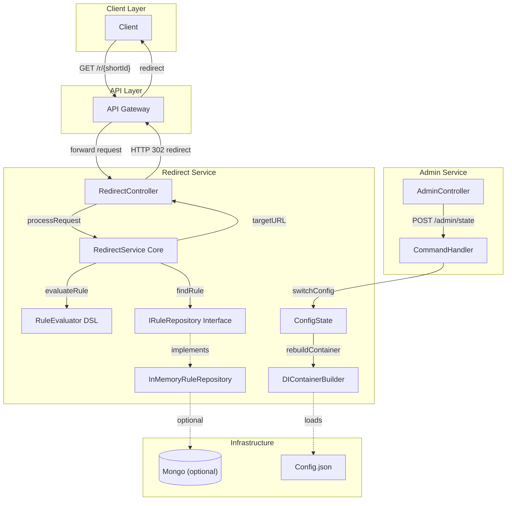

# 🧩 Проект: Микросервисная система переадресации запросов (Redirect Service)

## 🎯 Цель проекта

Реализовать учебный микросервисный проект, демонстрирующий:

* применение принципов **SOLID** и **чистой архитектуры (луковая/гексагональная)**;
* использование **паттернов проектирования** (Состояние, Команда, Адаптер, Билдер);
* поддержку **подключаемых модулей (плагинов)** через DI;
* использование **встроенного DSL-языка правил перенаправления**;
* запуск нескольких сервисов через **Docker Compose**.

---

## ⚙️ Общая идея

Система принимает запросы на короткие URL и перенаправляет клиента на целевой адрес по набору правил.

---

## 🏗️ Архитектура

### Уровни (луковая / гексагональная модель)

1. **Domain (Core)** — бизнес-сущности и интерфейсы портов.
2. **Application (Use Cases)** — логика применения правил, обработка команд, смена состояний.
3. **Infrastructure (Adapters)** — реализации портов (InMemory, Mongo, File и др.).
4. **Presentation (Edge)** — REST API для клиентов и административного управления.

---

## 🧩 Микросервисы

| Сервис              | Назначение                                                                                   | Примечание                                               |
| :------------------ | :------------------------------------------------------------------------------------------- | :------------------------------------------------------- |
| **RedirectService** | Основной сервис. Обрабатывает запросы `/r/{shortId}` и применяет правила перенаправления     | Включает DSL-интерпретатор, DI и поддержку состояний     |
| **AdminService**    | Управление правилами и состоянием RedirectService (CRUD, смена адаптера, сброс конфигурации) | Реализует REST-интерфейс                                 |
| **AuthService**     | Готовая реализация (уже существует)                                                          | Используется без изменений, только для получения токенов |

---

## 🔐 Авторизация

* **AuthService** уже реализован и протестирован (надо только сменить библиотеку cpp-httplib на Boost.Beast, т.к. первая не поддерживает асинхронность).
* RedirectService проверяет токен, выданный AuthService, публичным ключом.

---

## 📚 Плагины и адаптеры

Каждый внешний компонент подключается как адаптер, реализующий интерфейс порта.
Пример — интерфейс хранилища правил:

```cpp
class IRuleRepository {
public:
    virtual std::optional<Rule> findByKey(const std::string& key) = 0;
    virtual void save(const Rule& rule) = 0;
    virtual ~IRuleRepository() = default;
};
```

Реализации:

* `InMemoryRuleRepository` — используется по умолчанию;
* `MongoRuleRepository` — опционально, для демонстрации замены адаптера;
* `FileRuleRepository` — может быть добавлен как отдельный модуль.

---

## ⚙️ Dependency Injection и подключаемые модули

Для внедрения зависимостей используется **Boost.DI**.
Особенность — конфигурация **загружается из JSON-файла** при старте.

Пример:

```json
{
  "IRuleRepository": "InMemoryRuleRepository",
  "ILogSink": "ConsoleLogger"
}
```

* При запуске сервис строит DI-контейнер на основе конфигурации.
* При смене состояния (State Pattern) контейнер **пересобирается**, подключая другие адаптеры.
* Это позволяет динамически переключать режимы работы без изменения кода.

---

## 🧠 Используемые паттерны

| Паттерн                  | Применение                                           |
| :----------------------- | :--------------------------------------------------- |
| **State (Состояние)**    | Переключение конфигураций сервисов и DI-контейнера   |
| **Command (Команда)**    | Изменение правил, управление состоянием, сброс кэша  |
| **Adapter (Адаптер)**    | Реализации портов и подключаемые модули              |
| **Builder (Билдер)**     | Построение DI-контейнера и конфигурации              |
| **Strategy (Стратегия)** | Алгоритм применения DSL-правил при обработке запроса |

---

## 🌐 HTTP и асинхронность

* Используется **Boost.Beast**, полностью поддерживающий **асинхронный I/O** на базе **Boost.Asio**.
* Реализуются REST API:

  * `/r/{shortId}` — основной редирект;
  * `/admin/state` — смена состояния;
  * `/admin/rules` — управление правилами.

---

## 🧾 DSL для правил

В систему встроен **простой DSL (domain-specific language)**, позволяющий описывать условия перенаправления в виде строк:

```
if browser == "chromium" and date < "2026-01-01" then redirect = "http://target.com"
```

* DSL реализуется через собственный парсер или библиотеку **PEGTL**.
* Правила компилируются в дерево выражений и интерпретируются при каждом запросе.
* Расширяемость DSL обеспечивается за счёт отдельных модулей-обработчиков условий (плагины).

---

## 🧰 Технологический стек

| Компонент           | Технология                                |
| :------------------ | :---------------------------------------- |
| Язык                | C++20                                     |
| HTTP-сервер         | Boost.Beast                               |
| DI-контейнер        | Boost.DI                                  |
| Контейнеризация     | Docker + Docker Compose                   |
| Тестирование        | GoogleTest                                |
| Формат конфигурации | JSON                                      |
| Асинхронность       | Boost.Asio                                |
| DSL                 | PEGTL (опционально) или самописный парсер |
| Хранилище правил    | InMemory, Mongo, File (через адаптеры)    |

---

## 🧱 Основные компоненты RedirectService

| Компонент                 | Назначение                                      |
| :------------------------ | :---------------------------------------------- |
| **RedirectController**    | Обрабатывает HTTP-запросы клиентов              |
| **RedirectService**       | Основная логика выбора целевого URL             |
| **RuleRepository (порт)** | Интерфейс доступа к правилам                    |
| **RuleEvaluator**         | Интерпретация DSL-правил                        |
| **ConfigState**           | Управляет текущей конфигурацией (паттерн State) |
| **DIContainerBuilder**    | Загружает конфигурацию и создает зависимости    |

---

## 🧩 Диаграмма архитектуры


### Общая схема взаимодействия



---

## 🚀 Развёртывание

**docker-compose.yaml** поднимает:

* `redirect-service`;
* `admin-service`;
* (опционально) `mongo`;
* (внешний) `auth-service` — используется как есть, без изменений.

Каждый сервис содержит свой `Dockerfile`, JSON-конфиг и монтируемые volumes.

---

## 🧾 План реализации

1. **Создание структуры проекта (CMake + Docker)**
2. **Определение портов и доменных сущностей**
3. **Реализация DI-контейнера и загрузки JSON-конфига**
4. **Реализация State-паттерна и переключения адаптеров**
5. **Реализация RedirectService с InMemoryRepository**
6. **Реализация AdminService и команд управления**
7. **Добавление DSL-парсера**
8. **Интеграция Boost.Beast**
9. **Docker-compose и тесты (GoogleTest, покрытие ≥90%)**
10. **Подготовка отчета и архитектурных диаграмм**

---

## 🧩 Комментарий для преподавателя

> Проект сфокусирован на демонстрации **паттернов проектирования**, **гибкости конфигурации** и **гексагональной архитектуры**.
> Инфраструктурные аспекты (БД, кэш, очередь) упрощены намеренно — чтобы подчеркнуть принципы **SOLID**, **DI**, **State**, **Command**, **Builder**, **Adapter**.
> Все упрощения будут подробно зафиксированы в отчёте и коде комментариями.

---

